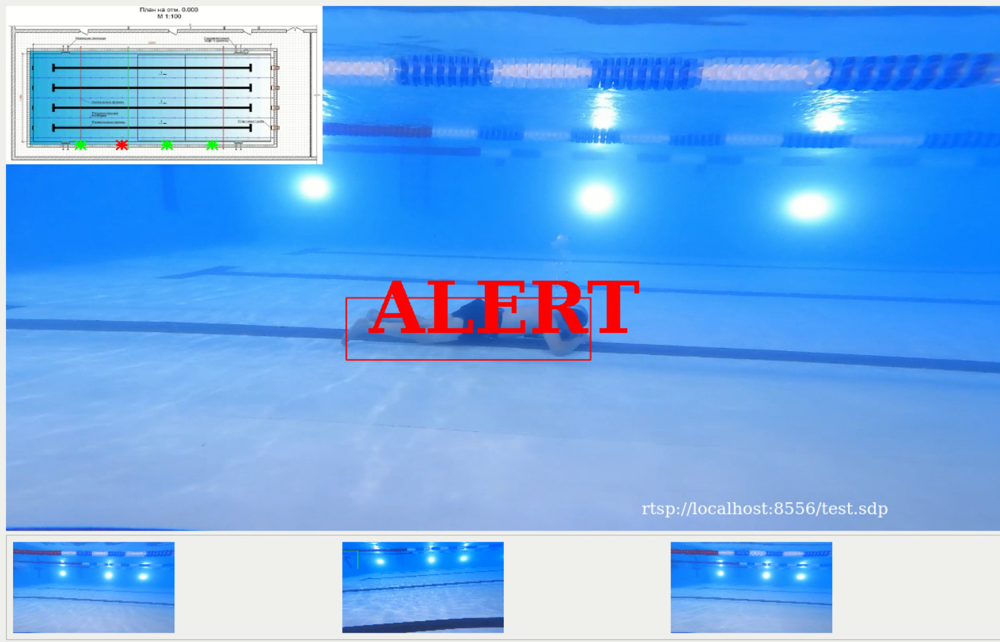
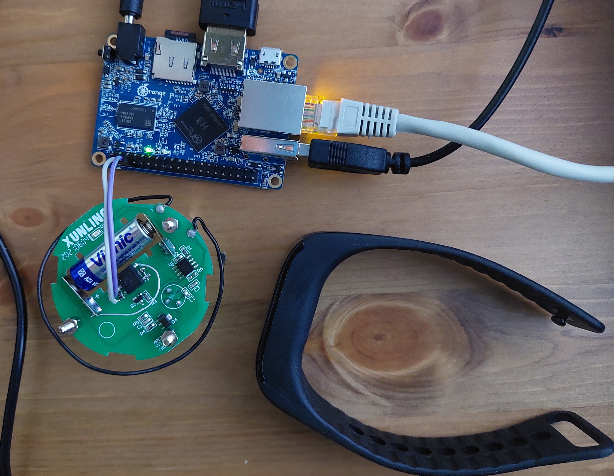
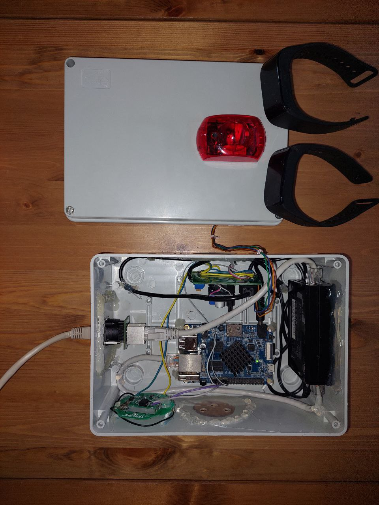

# Safe Swimming Pool API

POC

## Scene



## Maket



Thick Film Resistors - SMD 100 Ohms 250 mW 1206 5%

## Boxed with sirena



## Api
Turn on

```bash
curl --location --request POST 'http://<internal_ip>:8000/on'
```


Turn off

```bash
curl --location --request POST 'http://<internal_ip>:8000/off'
```